<div align="center">

# 💳 Financial Credit Risk Analytics
### Automated Consumer Credit-Risk Reporting Pipeline — Outlook ➜ Power Automate ➜ Drive ➜ BigQuery ➜ Power BI

<em>An end-to-end credit-risk analytics platform: raw customer credit data is ingested automatically, cleaned and modeled into a 7‑dimension star schema in Google BigQuery, and served through an 11‑page Power BI report.</em>


[**🔴 Live Power BI Report**](https://app.powerbi.com/groups/me/reports/feade1b7-637e-40bb-a4e0-32b5701f9470/tt01risksummary01?experience=power-bi) · [Screenshots](#-dashboard-gallery) · [Architecture](#%EF%B8%8F-solution-architecture) · [Data Model](#-data-model-star-schema) · [Getting Started](#-getting-started)

</div>

<br/>

## 📌 Table of Contents

- [Overview](#-overview)
- [Business Problem](#-business-problem)
- [Solution Architecture](#%EF%B8%8F-solution-architecture)
- [Data Model (Star Schema)](#-data-model-star-schema)
- [Dashboard Gallery](#-dashboard-gallery)
- [Key KPIs Tracked](#-key-kpis-tracked)
- [Repository Structure](#-repository-structure)
- [Tech Stack](#-tech-stack)
- [Getting Started](#-getting-started)
- [Data Quality & Known Limitations](#-data-quality--known-limitations-honest-take)
- [Bonus: Embeddable Widgets (React / JS / 3D)](#-bonus-embeddable-widgets-react--js--3d)
- [Roadmap](#-roadmap)
- [Contact](#-contact)

---

## 🚀 Overview

Banks and lenders traditionally receive customer financial/credit snapshots as periodic email attachments — manually downloaded, manually cleaned, and manually loaded into whatever tool is on hand. That's slow, inconsistent, and impossible to audit.

This project builds a **fully automated pipeline** for a **consumer credit-risk dataset** (one row per `Customer_ID` per `Month`, ~26 behavioral/financial attributes per customer):

1. **Ingest** — a Power Automate flow watches an Outlook mailbox, extracts attachments, and drops them into Google Drive.
2. **Load** — a Python/Colab notebook (`financial.ipynb`) authenticates against Google APIs and loads the raw files into a **Google BigQuery** staging table.
3. **Clean & Model** — nine BigQuery Standard SQL scripts (`sql/00`–`sql/08`) clean the raw data and build a **7-dimension / 1-fact star schema**.
4. **Analyze** — an automated EDA notebook (`notebooks/financial_eda.ipynb`) profiles the cleaned dataset with `ydata-profiling`, publishing an [interactive EDA report](docs/index.html).
5. **Visualize** — an 11-page **Power BI** report (`powerbi/Financial_Dashboard_Project.pbix`) turns the model into an executive-ready credit-risk dashboard.

> **GCP Project:** `financial-dashboard-500409` · **Dataset:** `financial_dashboard` · **Domain:** Consumer Banking / Personal Credit Risk

---

## 🏢 Business Problem

| Challenge | Impact |
|---|---|
| Credit reports arrive as monthly email attachments | Manual downloading, high error rate |
| No centralized, versioned raw-data store | Files scattered, hard to audit or reproduce |
| Repetitive, inconsistent data cleaning | Unreliable downstream metrics |
| No conformed dimensional model | Every report reinvents its own logic |
| No single source of truth for credit-risk KPIs | Slow, siloed decision-making |

**Solution:** automate ingestion end-to-end and expose a governed star schema as the single source of truth for credit-risk reporting.

---

## 🏗️ Solution Architecture

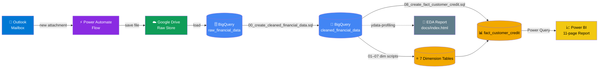

**No DML used anywhere** — every table is built with sandbox-safe `CREATE OR REPLACE TABLE ... AS SELECT`, so the whole model can be rebuilt from scratch with zero side effects.

---

## 📐 Data Model (Star Schema)

One fact table, **seven** conformed dimensions, zero snowflaking, surrogate keys generated via `ROW_NUMBER()`.

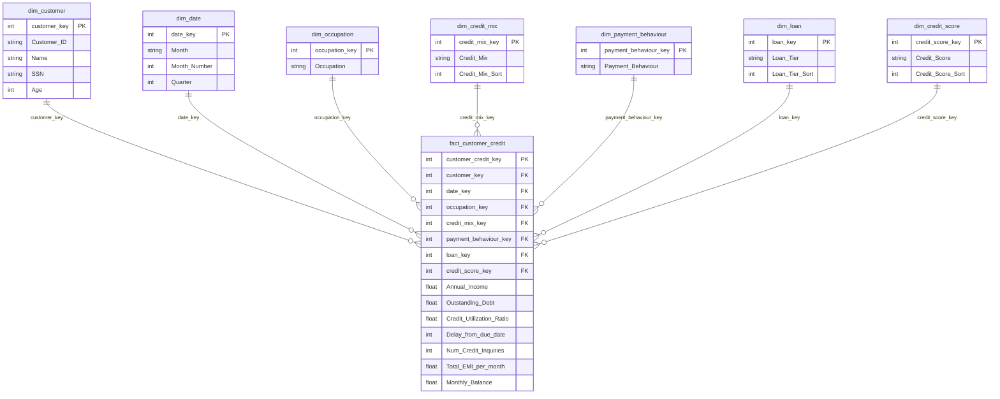

**Star schema health check** (from the project's own technical audit):

| Practice | Status |
|---|---|
| Single fact table, conformed dimensions | ✅ |
| Surrogate keys throughout | ✅ |
| No snowflaking | ✅ |
| Narrow fact table | ✅ |
| True calendar `dim_date` (with Year) | ⚠️ Month/Quarter only — source data has no Year field |
| Loan-type dimension | ⚠️ `dim_loan` is a volume-tier proxy — `Type_of_Loan` was dropped upstream |

---

## 🖼️ Dashboard Gallery

The Power BI report ships with drillthrough pages and a tooltip page, built on top of the star schema above.

<table>
<tr>
<td width="50%">

**Home**
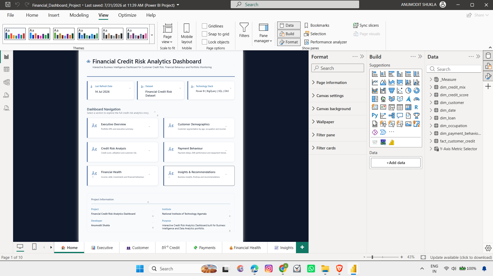

</td>
<td width="50%">

**Executive Summary**
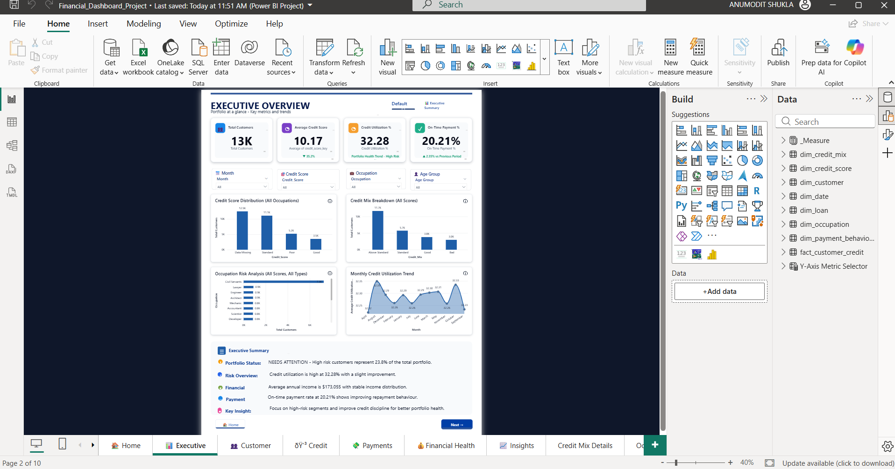

</td>
</tr>
<tr>
<td width="50%">

**Customer**
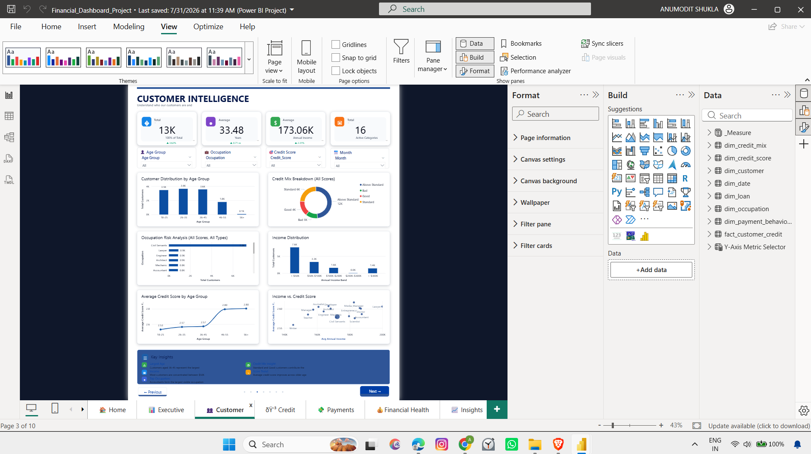

</td>
<td width="50%">

**Credits**
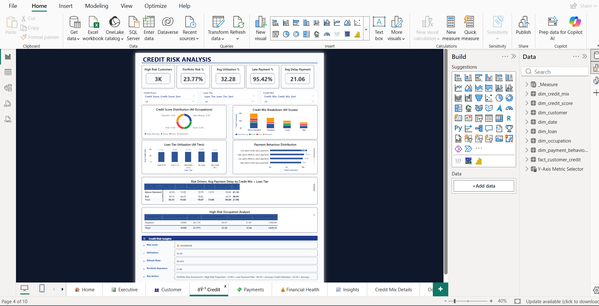

</td>
</tr>
<tr>
<td width="50%">

**Payments**
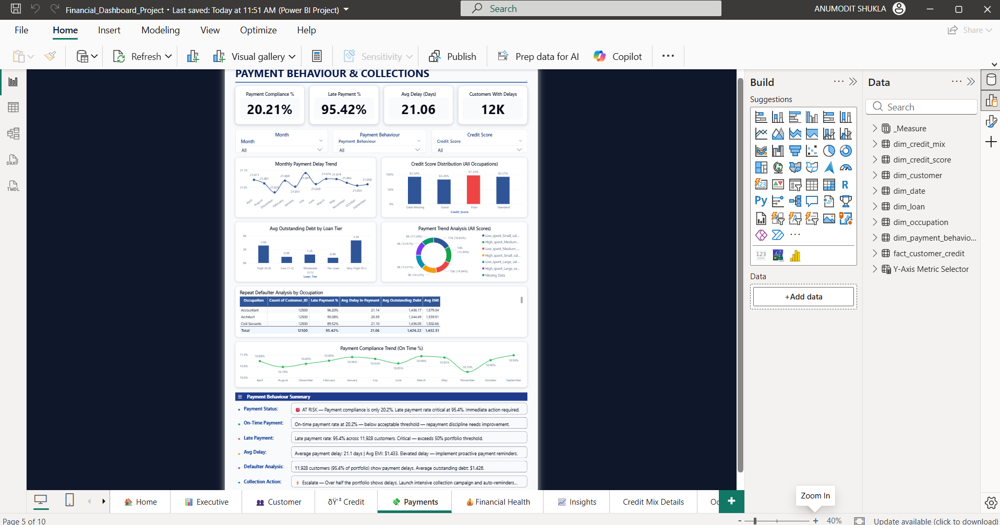

</td>
<td width="50%">

**Financial Health**
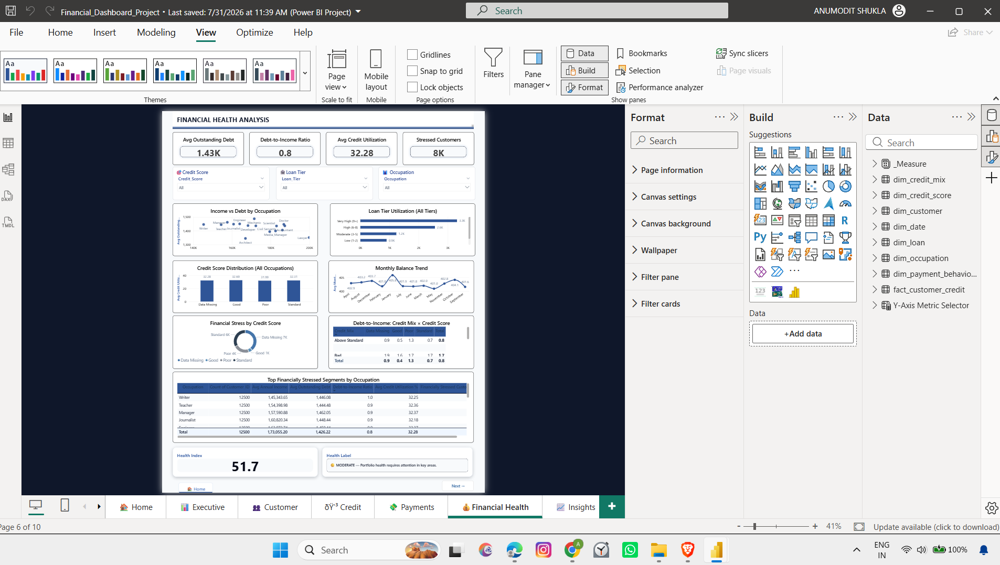

</td>
</tr>
<tr>
<td width="50%">

**Insights**
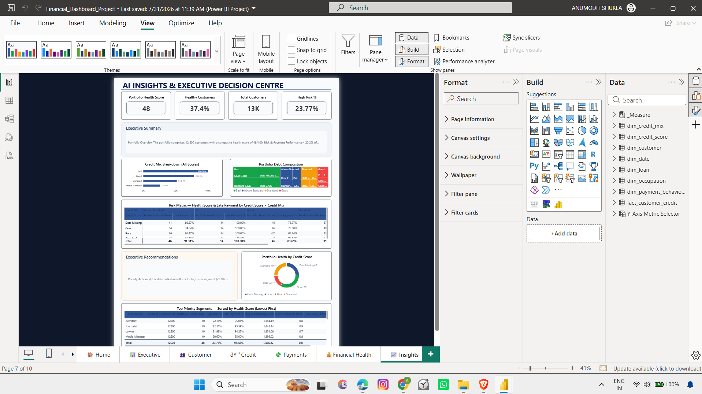

</td>
<td width="50%">

**Risk Summary (Tooltip Page)**


</td>
</tr>
<tr>
<td width="50%">

**Credit Mix Details (Drillthrough)**


</td>
<td width="50%">

**Occupation Details (Drillthrough)**


</td>
</tr>
</table>

<details>
<summary><strong>ETL / Power Query screenshots</strong></summary>
<br/>

| Power Query — Step 1 | Power Query — Step 2 |
|---|---|
| 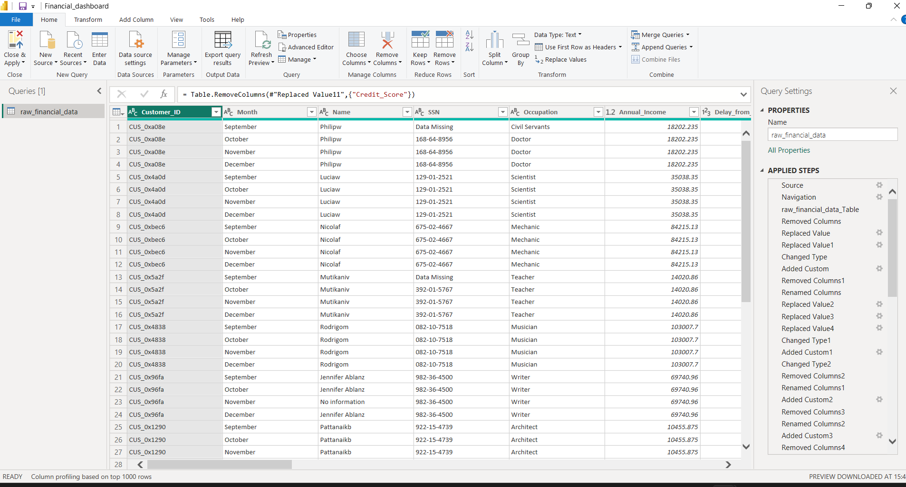 | 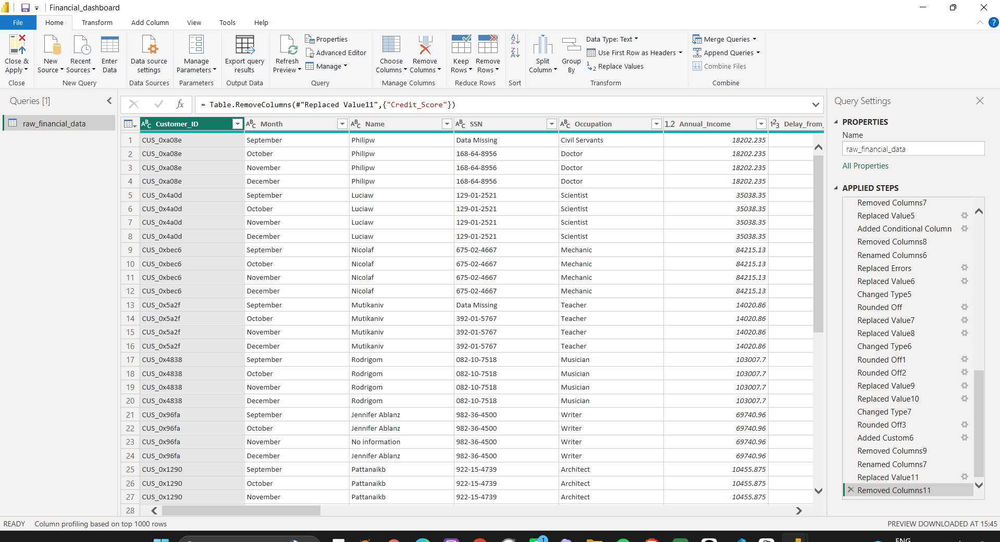 |

</details>

<details>
<summary><strong>Ingestion automation screenshots (Outlook → Power Automate → Drive)</strong></summary>
<br/>

| Outlook Automation | Power Automate Flow | Google Drive Store |
|---|---|---|
| 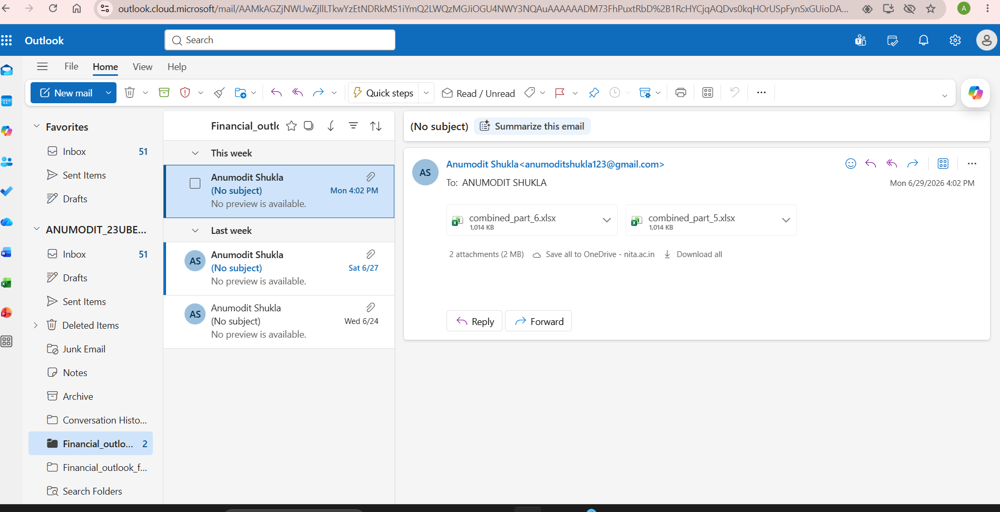 | 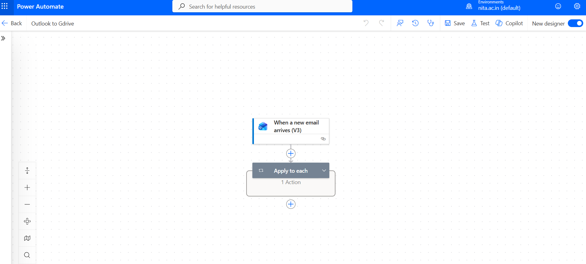 | 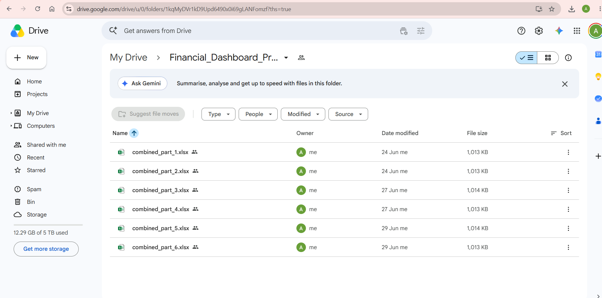 |

Additional flow detail: [`Power_automate_flow (2).png`](docs/screenshots/Power_automate_flow%20%282%29.png)

</details>

> 📄 A full automated **EDA report** (generated with `ydata-profiling`) is available at [`docs/index.html`](docs/index.html).

---

## 📊 Key KPIs Tracked

Pulled straight from the project's own KPI inventory (`sql/financial_dashboard_business_analytics.md`) — these are the metrics an executive/risk team would actually watch:

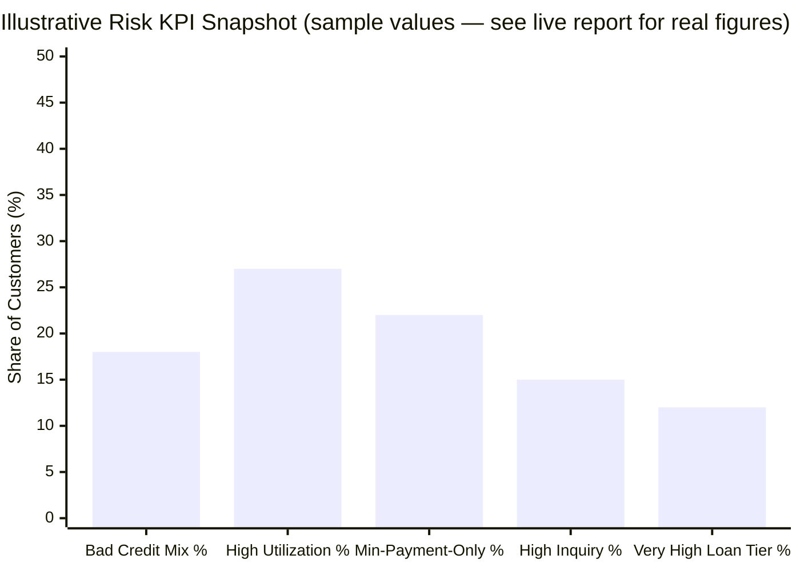

| # | KPI | Business Meaning |
|---|---|---|
| 1 | **Total Outstanding Debt Exposure** | Total credit risk carried across the portfolio |
| 2 | **Average Credit Utilization Ratio** | How aggressively customers use available credit |
| 3 | **% Customers in "Bad" Credit Mix** | Share of the portfolio in the worst credit-quality bucket |
| 4 | **Average Delay from Due Date** | Typical lateness in payments |
| 5 | **% Minimum-Payment-Only Customers** | Early-warning indicator of financial distress |
| 6 | **Debt-to-Income Ratio** | Core underwriting risk metric |
| 7 | **Loan Tier Distribution** | Portfolio composition by loan-volume risk bucket |
| 8 | **Average Credit Inquiries** | Credit-seeking / distress signal |
| 9 | **EMI Burden Ratio** | Share of income consumed by loan repayments |
| 10 | **Credit Health Index (composite)** | Blended score across utilization, mix, and inquiries |

Full list of 30+ KPIs, 20 ranked executive questions, and dimension-by-dimension analysis: [`sql/financial_dashboard_business_analytics.md`](sql/financial_dashboard_business_analytics.md).

---

## 📂 Repository Structure

```text
Financial-Credit-Risk-Analytics/
│
├── data/
│   ├── data_dictionary.md            # Column-level documentation
│   └── raw/                          # 25 raw source files (combined_part_1.xlsx … 25.xlsx)
│
├── docs/
│   ├── index.html                    # Automated EDA report (ydata-profiling)
│   ├── business_insights.md          # Reserved for narrative business insights
│   └── screenshots/                  # Ingestion pipeline screenshots
│       ├── Outlook_automation.png
│       ├── Power_Automate_Flow.png
│       ├── Power_automate_flow (2).png
│       └── gdrive.png
│
├── notebooks/
│   └── financial_eda.ipynb           # Generates the ydata-profiling EDA report
│
├── powerbi/
│   ├── Financial_Dashboard_Project.pbix
│   └── screenshots/                  # 11 dashboard/report screenshots
│
├── sql/
│   ├── 00_create_cleaned_financial_data.sql
│   ├── 01_create_dim_customer.sql
│   ├── 02_create_dim_date.sql
│   ├── 03_create_dim_occupation.sql
│   ├── 04_create_dim_credit_mix.sql
│   ├── 05_create_dim_payment_behaviour.sql
│   ├── 06_create_dim_loan.sql
│   ├── 07_create_dim_credit_score.sql
│   ├── 08_create_fact_customer_credit.sql
│   ├── financial_dashboard_technical_summary.md   # Full technical audit (16 sections)
│   └── financial_dashboard_business_analytics.md  # Full business/KPI audit (11 sections)
│
├── financial.ipynb                   # Colab notebook: Drive → BigQuery loader
└── README.md
```

---

## 🧰 Tech Stack

| Layer | Tool |
|---|---|
| Email ingestion | Microsoft Outlook |
| Workflow automation | Microsoft Power Automate |
| Raw file storage | Google Drive |
| Data warehouse | Google BigQuery (Standard SQL, sandbox mode — no DML) |
| ETL / transformation | BigQuery SQL (`sql/00`–`sql/08`) |
| EDA | Python, pandas, `ydata-profiling` |
| Data loading | Python (Google API client, Colab) |
| BI / Visualization | Power BI Desktop, Power Query, DAX |

---

## ⚙️ Getting Started

### Prerequisites
- Google Cloud account with BigQuery enabled
- Microsoft 365 account (Outlook + Power Automate) — only needed if you want to rebuild the ingestion flow
- Power BI Desktop
- Python 3.9+ (for the notebooks)

### Rebuild the model

```bash
git clone https://github.com/anumodit740/Financial-Credit-Risk-Analytics.git
cd Financial-Credit-Risk-Analytics
```

1. Create a BigQuery dataset named `financial_dashboard` in your GCP project.
2. Load the raw files from `data/raw/` into a `raw_financial_data` table.
3. Run the SQL scripts **in numeric order** — each is a sandbox-safe `CREATE OR REPLACE TABLE`:

   ```bash
   # from the BigQuery console or bq CLI, run in this exact order:
   sql/00_create_cleaned_financial_data.sql
   sql/01_create_dim_customer.sql
   sql/02_create_dim_date.sql
   sql/03_create_dim_occupation.sql
   sql/04_create_dim_credit_mix.sql
   sql/05_create_dim_payment_behaviour.sql
   sql/06_create_dim_loan.sql
   sql/07_create_dim_credit_score.sql
   sql/08_create_fact_customer_credit.sql
   ```
4. Open `powerbi/Financial_Dashboard_Project.pbix` in Power BI Desktop and point it at your BigQuery project.
5. (Optional) Run `notebooks/financial_eda.ipynb` to regenerate the EDA report at `docs/index.html`.

---

## ⚠️ Data Quality & Known Limitations (honest take)

This section exists because the project's own technical audit is unusually candid about it — and that honesty is worth keeping front and center rather than only in `sql/financial_dashboard_technical_summary.md`.

- **No `Year` field** — the source data only has month names, so YoY, rolling-12-month, and forecasting are not supported.
- **No geography or product data** — this is a pure customer/credit-risk dataset; there are no maps and no product-level analysis.
- **`dim_loan` is a volume-tier proxy** — `Type_of_Loan` was dropped upstream, so it's loan *volume*, not loan *type*.
- **`Credit_Score` is categorical** (`Poor` / `Standard` / `Good` / `Data Missing`, ~38% originally null), not a continuous bureau score.
- Several row/null/duplicate counts require a **live query** to state precisely — see the "Requires live query" markers throughout `sql/financial_dashboard_technical_summary.md`.

**Enterprise BI maturity self-score: 7 / 10** — strong star-schema fundamentals and a rich risk-signal set, held back by the missing calendar dimension and the lack of an incremental (vs. full-rebuild) load pattern.

---

## 🎁 Bonus: Embeddable Widgets (React / JS / 3D)

The Power BI report above is the primary deliverable, but here's starter code for embedding a lightweight, standalone KPI widget on a portfolio site or internal wiki — pulling the same shape of metrics as the dashboard.

### React + Recharts — Risk KPI Bar Chart

```jsx
import React from "react";
import {
  BarChart, Bar, XAxis, YAxis, CartesianGrid, Tooltip, ResponsiveContainer,
} from "recharts";

// Replace with a live fetch to your BigQuery-backed API in production
const riskKpiData = [
  { segment: "Bad Credit Mix", value: 18 },
  { segment: "High Utilization", value: 27 },
  { segment: "Min-Payment Only", value: 22 },
  { segment: "High Inquiries", value: 15 },
  { segment: "Very High Loan Tier", value: 12 },
];

export default function RiskKpiChart() {
  return (
    <ResponsiveContainer width="100%" height={320}>
      <BarChart data={riskKpiData} margin={{ top: 16, right: 24, left: 0, bottom: 24 }}>
        <CartesianGrid strokeDasharray="3 3" opacity={0.2} />
        <XAxis dataKey="segment" tick={{ fontSize: 12 }} interval={0} angle={-15} textAnchor="end" />
        <YAxis unit="%" />
        <Tooltip formatter={(v) => [`${v}%`, "Share of customers"]} />
        <Bar dataKey="value" radius={[6, 6, 0, 0]} fill="#F2A900" />
      </BarChart>
    </ResponsiveContainer>
  );
}
```

### Three.js — 3D Bar Chart (for a portfolio site, not GitHub-renderable)

GitHub markdown can't execute JavaScript, so this is provided as ready-to-drop-in code for your personal site (e.g. inside a `react-three-fiber` `<Canvas>`), rendering the same risk segments as extruded 3D bars:

```jsx
import React from "react";
import { Canvas } from "@react-three/fiber";
import { OrbitControls, Text } from "@react-three/drei";

const riskKpiData = [
  { segment: "Bad Mix", value: 18 },
  { segment: "High Util.", value: 27 },
  { segment: "Min Pay", value: 22 },
  { segment: "High Inq.", value: 15 },
  { segment: "Very High Loan", value: 12 },
];

function Bar3D({ position, height, label }) {
  return (
    <group position={position}>
      <mesh position={[0, height / 2, 0]}>
        <boxGeometry args={[0.8, height, 0.8]} />
        <meshStandardMaterial color="#F2A900" />
      </mesh>
      <Text position={[0, -0.4, 0]} fontSize={0.22} color="#333" anchorX="center">
        {label}
      </Text>
    </group>
  );
}

export default function RiskKpi3DChart() {
  return (
    <Canvas camera={{ position: [6, 6, 8], fov: 45 }} style={{ height: 400 }}>
      <ambientLight intensity={0.6} />
      <directionalLight position={[5, 8, 5]} intensity={0.8} />
      {riskKpiData.map((d, i) => (
        <Bar3D
          key={d.segment}
          position={[i * 1.4 - (riskKpiData.length * 1.4) / 2, 0, 0]}
          height={d.value / 5}
          label={d.segment}
        />
      ))}
      <OrbitControls enablePan={false} />
    </Canvas>
  );
}
```

> Both snippets are illustrative starter code, not part of the BigQuery/Power BI pipeline itself — swap `riskKpiData` for a live call to your own API layer if you wire one up.

---

## 🔮 Roadmap

- [ ] Add a true calendar `dim_date` (requires a `Year` field in the source data)
- [ ] Move from full `CREATE OR REPLACE TABLE` rebuilds to incremental `MERGE`-based loads
- [ ] Build the field-parameter "measure switcher" and composite Credit Health Index outlined in `sql/financial_dashboard_business_analytics.md`
- [ ] Row-Level Security (RLS) on the Power BI report
- [ ] CI check that runs the SQL scripts 00→08 against a scratch dataset on every PR

---

## 📞 Contact

- GitHub: [@anumodit740](https://github.com/anumodit740)
- LinkedIn: [Anumodit](https://linkedin.com/in/anumodit740)
- Live report: [Power BI — Risk Summary](https://app.powerbi.com/groups/me/reports/feade1b7-637e-40bb-a4e0-32b5701f9470/tt01risksummary01?experience=power-bi)

<div align="center">

**If this project is useful, a ⭐ is appreciated.**


</div>
