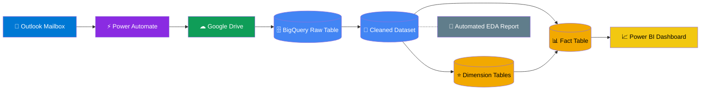
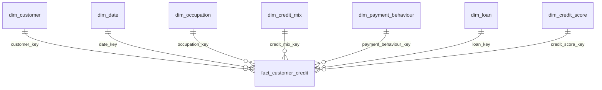

<div align="center">

# 💳 Financial Credit Risk Analytics

### Enterprise Credit Risk Analytics Platform
### Outlook ➜ Power Automate ➜ Google Drive ➜ BigQuery ➜ Power BI

<p align="center">
An end-to-end data analytics project that automates credit-risk data ingestion, transforms raw financial records into a dimensional data warehouse, and delivers executive dashboards through Microsoft Power BI.
</p>

<br>


<br>

[**🔴 Live Power BI Report**](https://app.powerbi.com/groups/me/reports/feade1b7-637e-40bb-a4e0-32b5701f9470/01f4a5c8e7b64d2a9c10?experience=power-bi)
•
[Dashboard Gallery](#-dashboard-gallery)
•
[Architecture](#️-solution-architecture)
•
[Data Model](#-data-model-star-schema)
•
[Getting Started](#-getting-started)

</div>

---

# 📑 Table of Contents

- [Project Overview](#-project-overview)
- [Project Highlights](#-project-highlights)
- [Business Problem](#-business-problem)
- [Solution Architecture](#️-solution-architecture)
- [Data Model (Star Schema)](#-data-model-star-schema)
- [Dashboard Gallery](#-dashboard-gallery)
- [Key Business KPIs](#-key-business-kpis)
- [Repository Structure](#-repository-structure)
- [Technology Stack](#-technology-stack)
- [Getting Started](#-getting-started)
- [Data Quality & Limitations](#-data-quality--limitations)
- [Roadmap](#-roadmap)
- [Contact](#-contact)

---

# 🚀 Project Overview

Financial institutions often receive monthly customer credit reports through email attachments. Manually downloading, cleaning, transforming, and analyzing these files is repetitive, error-prone, and difficult to audit.

This project demonstrates a complete analytics workflow that automates the entire reporting lifecycle—from email ingestion to executive dashboards—using modern data engineering and business intelligence tools.

The pipeline performs:

1. **Automated Ingestion**
   - Monitors Outlook mailbox
   - Detects new attachments
   - Triggers Power Automate
   - Stores files in Google Drive

2. **Data Loading**
   - Python notebook authenticates using Google APIs
   - Loads raw Excel files into Google BigQuery

3. **Data Transformation**
   - Cleans source data
   - Creates dimensional warehouse
   - Builds a 7-dimension Star Schema
   - Generates analytical fact table

4. **Exploratory Data Analysis**
   - Automated profiling using `ydata-profiling`
   - Generates HTML EDA report

5. **Business Intelligence**
   - Interactive Microsoft Power BI dashboard
   - Executive KPIs
   - Drill-through reports
   - Tooltips
   - Business insights

---

# ✨ Project Highlights

| Feature | Description |
|----------|-------------|
| 📧 Automated Data Ingestion | Outlook → Power Automate → Google Drive |
| ☁ Cloud Data Warehouse | Google BigQuery |
| ⭐ Data Warehouse Design | 7 Dimension + 1 Fact Star Schema |
| 📊 Business Intelligence | 11 Interactive Power BI Pages |
| 📈 Executive Reporting | 30+ Credit Risk KPIs |
| 🧹 Data Cleaning | SQL Transformation Pipeline |
| 🐍 Python Automation | Google API + EDA |
| 📑 Automated Profiling | ydata-profiling |
| ⚡ Interactive Analysis | Drill-through & Tooltips |
| 📌 Executive Dashboard | Business-ready insights |

---

# 🏢 Business Problem

Financial institutions continuously receive customer credit reports through monthly email attachments.

Traditional reporting workflows involve:

| Challenge | Business Impact |
|------------|-----------------|
| Manual attachment download | Time-consuming and repetitive |
| Scattered source files | Difficult to audit |
| Inconsistent data cleaning | Unreliable KPIs |
| Duplicate business logic | Multiple versions of truth |
| Poor scalability | Increasing maintenance effort |

### Proposed Solution

Build an automated analytics pipeline that:

- Eliminates manual ingestion
- Standardizes data transformation
- Creates a governed dimensional model
- Produces reliable executive KPIs
- Enables interactive business reporting

---

# 🏗️ Solution Architecture



### Data Flow

```
Outlook
     ↓
Power Automate
     ↓
Google Drive
     ↓
Python Loader
     ↓
BigQuery
     ↓
SQL Transformations
     ↓
Star Schema
     ↓
Power BI
```

---

# 📐 Data Model (Star Schema)

The warehouse follows **Kimball dimensional modeling** principles using one centralized fact table connected to seven conformed dimensions.

## Star Schema



### Warehouse Design

| Component | Count |
|-----------|------:|
| Fact Tables | 1 |
| Dimension Tables | 7 |
| Surrogate Keys | ✓ |
| Snowflake Schema | ✗ |
| Star Schema | ✓ |
| Slowly Changing Dimensions | Static |
| Analytical Model | Dimensional |

### Dimension Tables

- dim_customer
- dim_date
- dim_occupation
- dim_credit_mix
- dim_payment_behaviour
- dim_loan
- dim_credit_score

### Fact Table

**fact_customer_credit**

Stores analytical measures including:

- Annual Income
- Outstanding Debt
- Monthly Balance
- EMI
- Credit Utilization
- Delay from Due Date
- Credit Inquiries

---
# 🖼️ Dashboard Gallery

The Power BI report is designed for executive decision-making and consists of **11 interactive report pages**, including drill-through analysis, custom tooltip pages, and Power Query transformation views.

## 📊 Dashboard Overview

| Dashboard | Description |
|-----------|-------------|
| 🏠 Home | Overall portfolio summary and navigation |
| 📈 Executive Summary | Business KPIs and executive insights |
| 👥 Customer Analysis | Customer demographics and segmentation |
| 💳 Credit Analysis | Credit score and credit mix analysis |
| 💰 Payment Analysis | Payment behaviour and due-date trends |
| ❤️ Financial Health | Income, debt, utilization and EMI analysis |
| 💡 Business Insights | Key analytical observations |
| 🎯 Risk Summary | Interactive tooltip page |
| 🔍 Credit Mix Details | Drill-through report |
| 👔 Occupation Details | Drill-through report |
| ⚙️ Power Query | ETL and transformation steps |

---

## 🏠 Home Dashboard


**Purpose**

- Executive landing page
- Navigation hub
- Portfolio snapshot
- Quick KPI overview

---

## 📈 Executive Summary


### Key Insights

- Portfolio Health
- Credit Distribution
- Outstanding Debt
- Customer Risk
- Credit Utilization
- Executive KPIs

---

## 👥 Customer Analytics


### Analysis Includes

- Customer demographics
- Occupation distribution
- Income analysis
- Customer segmentation
- Credit behaviour

---

## 💳 Credit Analysis


### Analysis Includes

- Credit Score
- Credit Mix
- Credit Utilization
- Loan Categories
- Credit Risk Distribution

---

## 💰 Payment Behaviour


### Analysis Includes

- Payment delays
- Monthly balances
- EMI trends
- Payment behaviour
- Outstanding debt

---

## ❤️ Financial Health Dashboard


### Analysis Includes

- Annual Income
- Debt Analysis
- Credit Utilization
- EMI Burden
- Financial Stability

---

## 💡 Business Insights


Provides executive-level insights for:

- Portfolio risk
- High-risk customers
- Credit quality
- Business trends
- Decision support

---

# 🎯 Interactive Pages

## Risk Summary Tooltip


Custom tooltip page providing contextual information without leaving the current report.

---

## Credit Mix Drill-through


Allows users to drill into individual Credit Mix categories for deeper analysis.

---

## Occupation Drill-through


Provides occupation-wise customer behaviour and financial performance.

---

# ⚙️ Power Query (ETL)

| Step 1 | Step 2 |
|---------|---------|
|  |  |

Power Query is used to

- Clean raw data
- Transform attributes
- Standardize formats
- Prepare analytical tables
- Build reporting model

---

# 🔄 Data Ingestion Automation

The entire ingestion process is automated using Microsoft technologies.

| Outlook | Power Automate | Google Drive |
|---------|----------------|--------------|
|  |  |  |

Additional workflow details

```
docs/screenshots/Power_automate_flow (2).png
```

---

# 📄 Automated Exploratory Data Analysis

The project also includes an automated **EDA Report** generated using **ydata-profiling**.

```
docs/index.html
```

The report includes

- Missing Values
- Data Types
- Distribution Analysis
- Correlation Analysis
- Duplicate Detection
- Statistical Summary
- Feature Relationships

---

# 📈 Dashboard Features

| Feature | Status |
|----------|:------:|
| Executive Dashboard | ✅ |
| Interactive Navigation | ✅ |
| Drill Through | ✅ |
| Custom Tooltips | ✅ |
| Dynamic Filtering | ✅ |
| Power Query ETL | ✅ |
| Star Schema | ✅ |
| DAX Measures | ✅ |
| KPI Cards | ✅ |
| Conditional Formatting | ✅ |
| Slicers | ✅ |
| Cross Filtering | ✅ |
| Bookmarks | ✅ |
| Responsive Layout | ✅ |

---

# 📊 Key Business KPIs

The dashboard tracks more than **30 business KPIs** across customer credit performance, financial health, and portfolio risk.

## Executive KPIs

| KPI | Business Purpose |
|-----|------------------|
| Total Customers | Portfolio Size |
| Total Outstanding Debt | Credit Exposure |
| Average Annual Income | Customer Income Level |
| Monthly Balance | Financial Health |
| Credit Utilization Ratio | Credit Usage |
| Average EMI | Debt Burden |
| Average Credit Inquiries | Risk Indicator |
| Average Payment Delay | Payment Behaviour |
| High Risk Customers | Portfolio Monitoring |
| Good Credit Score % | Portfolio Quality |

---

## Risk Monitoring KPIs

- Debt-to-Income Ratio
- High Utilization Customers
- Minimum Payment Customers
- Credit Mix Distribution
- Loan Tier Distribution
- Credit Score Distribution
- Financial Stress Index
- Portfolio Risk Score
- Average Outstanding Debt
- Monthly Payment Burden

---

# ⭐ Business Questions Answered

The dashboard helps answer business questions such as:

- Which customers are financially stressed?
- Which occupations have the highest risk?
- Which credit mix performs best?
- How does payment behaviour impact credit score?
- Which customer segments generate the highest credit exposure?
- Which loan tier contributes most to outstanding debt?
- What factors drive poor credit scores?
- How healthy is the overall customer portfolio?

---

# 📂 Repository Structure

```text
Financial-Credit-Risk-Analytics
│
├── data
│   ├── raw
│   │   ├── combined_part_1.xlsx
│   │   ├── ...
│   │   └── combined_part_25.xlsx
│   └── data_dictionary.md
│
├── docs
│   ├── index.html
│   ├── business_insights.md
│   └── screenshots
│       ├── Outlook_automation.png
│       ├── Power_Automate_Flow.png
│       ├── Power_automate_flow (2).png
│       └── gdrive.png
│
├── notebooks
│   └── financial_eda.ipynb
│
├── powerbi
│   ├── Financial_Dashboard_Project.pbix
│   └── screenshots
│       ├── Home.png
│       ├── Executive.png
│       ├── Customer.png
│       ├── Credits.png
│       ├── Payments.png
│       ├── Financial_health.png
│       ├── Insights.png
│       ├── Risk summary tooltip page.png
│       ├── Credit_mix_details(drill through page).png
│       ├── Occupation_details(drill through page).png
│       ├── Power_query_1.png
│       └── Power_query_2.png
│
├── sql
│   ├── 00_create_cleaned_financial_data.sql
│   ├── 01_create_dim_customer.sql
│   ├── 02_create_dim_date.sql
│   ├── 03_create_dim_occupation.sql
│   ├── 04_create_dim_credit_mix.sql
│   ├── 05_create_dim_payment_behaviour.sql
│   ├── 06_create_dim_loan.sql
│   ├── 07_create_dim_credit_score.sql
│   ├── 08_create_fact_customer_credit.sql
│   ├── financial_dashboard_technical_summary.md
│   └── financial_dashboard_business_analytics.md
│
├── financial.ipynb
└── README.md
```

---

# 📁 Visual Assets

```text
Dashboard Screenshots
│
├── 🏠 Home
├── 📈 Executive Summary
├── 👥 Customer Analysis
├── 💳 Credit Analysis
├── 💰 Payment Analysis
├── ❤️ Financial Health
├── 💡 Business Insights
├── 🎯 Risk Summary Tooltip
├── 🔍 Credit Mix Drill-through
├── 👔 Occupation Drill-through
├── ⚙️ Power Query Step 1
└── ⚙️ Power Query Step 2
```

---# 🛠️ Technology Stack

This project combines **data engineering**, **cloud analytics**, **business intelligence**, and **automation** technologies to build an end-to-end credit risk analytics platform.

---

## 📊 Technology Overview

| Layer | Technology | Purpose |
|---------|------------|---------|
| Data Source | Excel Files | Monthly customer credit reports |
| Email Service | Microsoft Outlook | Incoming attachment monitoring |
| Workflow Automation | Microsoft Power Automate | Automatic ingestion |
| Cloud Storage | Google Drive | Raw data storage |
| Programming Language | Python | Data loading & automation |
| APIs | Google Drive API | Cloud integration |
| Notebook Environment | Google Colab | ETL execution |
| Data Warehouse | Google BigQuery | Cloud analytical database |
| SQL Engine | BigQuery Standard SQL | Data transformation |
| Data Modeling | Star Schema | Analytical warehouse |
| ETL | SQL + Power Query | Data transformation |
| EDA | pandas + ydata-profiling | Data profiling |
| Business Intelligence | Microsoft Power BI | Dashboard development |
| Data Preparation | Power Query | Cleaning & shaping |
| Analytics Language | DAX | KPI calculations |
| Version Control | Git & GitHub | Source code management |

---

# ⚡ Project Workflow

```text
Monthly Credit Files
          │
          ▼
Microsoft Outlook
          │
          ▼
Power Automate Flow
          │
          ▼
Google Drive
          │
          ▼
Python ETL Loader
          │
          ▼
Google BigQuery
          │
          ▼
Data Cleaning
          │
          ▼
Star Schema
          │
          ▼
Power BI Dashboard
```

---

# 🏗️ Data Warehouse Layers

The warehouse follows a simplified analytical architecture.

## 🟦 Raw Layer

Purpose

- Store original files
- Preserve source data
- Maintain auditability

Output

```
raw_financial_data
```

---

## 🟨 Clean Layer

Purpose

- Remove invalid values
- Handle missing data
- Standardize formats
- Improve consistency

Output

```
cleaned_financial_data
```

---

## 🟩 Dimensional Layer

Creates analytical dimensions.

Dimensions include

- dim_customer
- dim_date
- dim_credit_mix
- dim_payment_behaviour
- dim_credit_score
- dim_occupation
- dim_loan

---

## 🟥 Fact Layer

```
fact_customer_credit
```

Stores analytical measures including

- Income
- Debt
- Monthly Balance
- EMI
- Credit Utilization
- Credit Inquiries
- Payment Delay

---

# 📂 SQL Pipeline

Execute SQL scripts in the following order.

| Order | Script |
|--------|--------|
| 00 | create_cleaned_financial_data.sql |
| 01 | create_dim_customer.sql |
| 02 | create_dim_date.sql |
| 03 | create_dim_occupation.sql |
| 04 | create_dim_credit_mix.sql |
| 05 | create_dim_payment_behaviour.sql |
| 06 | create_dim_loan.sql |
| 07 | create_dim_credit_score.sql |
| 08 | create_fact_customer_credit.sql |

---

# 🚀 Getting Started

## Prerequisites

Install or create access to the following.

### Cloud

- Google Cloud Platform
- BigQuery
- Google Drive

### Microsoft

- Outlook
- Power Automate
- Power BI Desktop

### Python

- Python 3.9+
- pandas
- numpy
- google-api-python-client
- ydata-profiling

---

# 📥 Clone Repository

```bash
git clone https://github.com/anumodit740/Financial-Credit-Risk-Analytics.git

cd Financial-Credit-Risk-Analytics
```

---

# ☁️ BigQuery Setup

Create a dataset.

```
financial_dashboard
```

Import all raw Excel files into

```
raw_financial_data
```

---

# ⚙️ Execute SQL Pipeline

Run every SQL script sequentially.

```text
00_create_cleaned_financial_data.sql

01_create_dim_customer.sql

02_create_dim_date.sql

03_create_dim_occupation.sql

04_create_dim_credit_mix.sql

05_create_dim_payment_behaviour.sql

06_create_dim_loan.sql

07_create_dim_credit_score.sql

08_create_fact_customer_credit.sql
```

After execution the warehouse will contain

```
7 Dimension Tables

1 Fact Table
```

---

# 📊 Open Power BI

Open

```
powerbi/
    Financial_Dashboard_Project.pbix
```

Update the BigQuery connection.

Refresh the dataset.

Explore the dashboard.

---

# 📄 Generate EDA Report

Run

```
financial.ipynb
```

or

```
notebooks/
    financial_eda.ipynb
```

Generated output

```
docs/
    index.html
```

---

# 📈 Project Statistics

| Metric | Value |
|---------|------:|
| Source Files | 25 |
| Fact Tables | 1 |
| Dimension Tables | 7 |
| SQL Scripts | 9 |
| Dashboard Pages | 11 |
| Business KPIs | 30+ |
| Drill-through Pages | 2 |
| Tooltip Pages | 1 |
| Power Query Screens | 2 |
| Automated Pipeline | Yes |
| Cloud Warehouse | Google BigQuery |

---

# 🔒 Data Quality & Validation

Several validation checks are performed during transformation.

✅ Missing Value Handling

✅ Data Type Standardization

✅ Duplicate Detection

✅ Null Replacement

✅ Credit Score Cleaning

✅ Income Validation

✅ Payment Behaviour Cleaning

✅ Loan Tier Categorization

✅ Schema Validation

---

# ⚠️ Known Limitations

Although the project demonstrates a production-style analytics workflow, several limitations originate from the source dataset.

| Limitation | Impact |
|------------|--------|
| No Year column | No YoY or time-series forecasting |
| No Geographic Data | No map visualizations |
| Loan Type unavailable | Loan Tier used instead |
| Static dataset | No incremental loading |
| Categorical Credit Score | No bureau score prediction |

---

# 💡 Future Improvements

Potential enhancements include

- Incremental ETL pipeline
- Scheduled BigQuery refresh
- Partitioned tables
- Clustered tables
- Row-Level Security (RLS)
- CI/CD deployment
- Data quality monitoring
- Automated testing
- Cloud Functions
- BigQuery scheduled queries
- Power BI Service refresh
- Advanced DAX optimization

---# 🚀 Roadmap

The project demonstrates a complete end-to-end analytics workflow. Future enhancements will focus on scalability, automation, cloud engineering, and enterprise BI best practices.

---

## 📅 Planned Improvements

### Data Engineering

- [ ] Implement Incremental ETL Pipeline
- [ ] Replace Full Refresh with MERGE Operations
- [ ] Partition BigQuery Tables
- [ ] Cluster High-Volume Tables
- [ ] Add Data Validation Rules
- [ ] Build Data Quality Dashboard
- [ ] Create Automated Audit Tables

---

### Cloud & Automation

- [ ] Schedule BigQuery Jobs
- [ ] Automate Dataset Refresh
- [ ] Deploy Cloud Functions
- [ ] Implement CI/CD using GitHub Actions
- [ ] Enable Automated Testing
- [ ] Configure Alerting & Monitoring

---

### Power BI

- [ ] Row-Level Security (RLS)
- [ ] Incremental Refresh
- [ ] Calculation Groups
- [ ] Field Parameters
- [ ] Dynamic Measure Selector
- [ ] What-if Parameters
- [ ] Mobile Layout Optimization

---

### Analytics

- [ ] Customer Risk Segmentation
- [ ] Credit Health Index
- [ ] Predictive Credit Risk Model
- [ ] Customer Lifetime Value
- [ ] Customer Cohort Analysis
- [ ] Portfolio Trend Analysis

---

# 🏆 Learning Outcomes

This project demonstrates practical experience in:

## Data Engineering

- SQL Data Transformation
- ETL Pipelines
- Data Cleaning
- Data Modeling
- Star Schema Design
- Data Warehousing

---

## Cloud Analytics

- Google BigQuery
- Google Drive API
- Cloud Data Storage
- SQL Optimization

---

## Business Intelligence

- Microsoft Power BI
- Power Query
- DAX
- Dashboard Design
- Drill-through Reports
- Interactive Tooltips
- Executive Reporting

---

## Python

- Data Loading
- Automation
- Exploratory Data Analysis
- Data Profiling

---

## Business Analytics

- KPI Design
- Executive Dashboards
- Credit Risk Analytics
- Financial Analysis
- Business Storytelling

---

# 📌 Repository Overview

| Folder | Description |
|----------|-------------|
| **data/** | Raw source files and documentation |
| **docs/** | EDA report and pipeline screenshots |
| **notebooks/** | Data profiling notebooks |
| **powerbi/** | PBIX dashboard and screenshots |
| **sql/** | Data warehouse SQL scripts |
| **financial.ipynb** | Data loading notebook |
| **README.md** | Project documentation |

---

# ⭐ Why This Project?

Unlike a traditional Power BI dashboard, this project covers the complete analytics lifecycle.

✅ Automated Data Ingestion

✅ Cloud Storage

✅ Data Warehousing

✅ SQL Data Transformation

✅ Star Schema Modeling

✅ Exploratory Data Analysis

✅ Executive Dashboard

✅ Business KPIs

✅ Interactive Reporting

✅ Production-style Documentation

---

# 📷 Project Preview

| Component | Available |
|-----------|:---------:|
| Dashboard Screenshots | ✅ |
| Power Query Images | ✅ |
| Automation Screenshots | ✅ |
| Architecture Diagram | ✅ |
| Star Schema Diagram | ✅ |
| Repository Structure | ✅ |
| SQL Scripts | ✅ |
| EDA Report | ✅ |
| Power BI File | ✅ |

---

# 🤝 Contributing

Contributions are welcome.

If you would like to improve this project:

1. Fork the repository
2. Create a feature branch

```bash
git checkout -b feature/your-feature
```

3. Commit your changes

```bash
git commit -m "Add new feature"
```

4. Push to GitHub

```bash
git push origin feature/your-feature
```

5. Open a Pull Request

---

# 📜 License

This repository is intended for educational, portfolio, and learning purposes.

Please provide appropriate attribution if you reuse significant portions of the project.

---

# 👨‍💻 Author

## Anumodit Shukla

**Data Analyst | Data Engineer Enthusiast | Business Intelligence**

- 🔗 GitHub: https://github.com/anumodit740
- 💼 LinkedIn: https://linkedin.com/in/anumodit740
- 📊 Live Power BI Report:
  https://app.powerbi.com/groups/me/reports/feade1b7-637e-40bb-a4e0-32b5701f9470/01f4a5c8e7b64d2a9c10?experience=power-bi

---

# 🙏 Acknowledgements

Special thanks to the open-source tools and platforms that made this project possible.

- Google BigQuery
- Microsoft Power BI
- Microsoft Power Automate
- Microsoft Outlook
- Google Drive
- Google Colab
- Python
- pandas
- ydata-profiling
- GitHub

---

<div align="center">

# ⭐ If you found this project useful, consider giving it a Star!

It helps others discover the project and motivates future improvements.

<br>


---

### Built with ❤️ using

**Python • SQL • Google BigQuery • Power BI • Power Query • DAX • Power Automate**

---

### ⭐ Thank you for visiting this repository!

</div>
